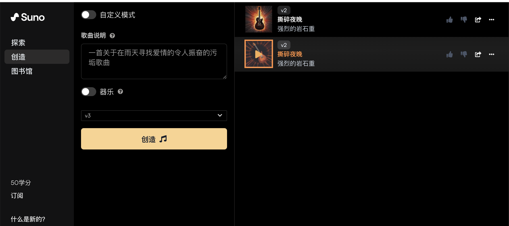
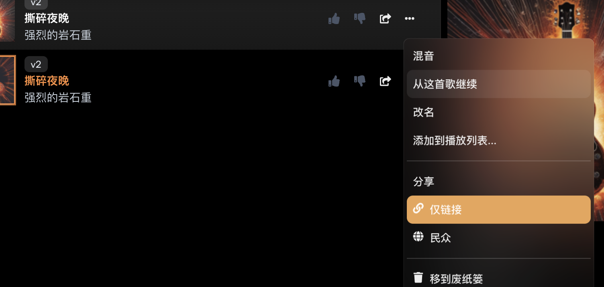

Suno 是一款文本音乐生成器，可帮助人们根据输入的提示创作不同风格、乐器、旋律的原创曲目。由于其独特性、生成速度快、生成的歌词优秀，标志着生成式人工智能创作音乐的巨大进步。该工具可以通过其免费的独立网站访问 ，也可以在Microsoft Copilot通过启用 Suno 的第三方插件访问。

Suno使用扩散模型diffusion model.每当用户输入提示时，它都会创建一个编码所请求的音乐特征的潜在表示，然后生成并完善音频样本。

### 如何使用 Suno 创建音乐视频歌曲
>Suno 用户每天免费获得 50 个积分。生成一首歌曲需要 10 个积分。如果您需要更多积分，您可以每月支付 8 美元升级到 Pro Plan，即每月获得 2,500 个积分；或 Premier 计划，您可以每月获得 10,000 个积分。

### 1.访问Suno官方网站，然后进入其音乐生成页面。移至创建部分。

Suno提供两种生成模式，一种是AI模式，另一种是自定义模式。在自定义模式下，您可以使用自己的歌词，选择音乐风格。至于AI模式，您所需要做的就是输入歌曲描述，然后点击“创造”(create)
 

### 步骤2.延长Suno音乐长度
Suno 将为每个提示生成两个剪辑，但是输出只有 1 分钟左右，这对于歌曲来说太短了。选择您喜欢的一个剪辑，单击三个水平点，然后选择“从这首歌继续”。对一段较长的音乐重复音乐生成过程。

### 步骤 3. 下载并分享
单击您生成的最后一个剪辑旁边的三个水平点，然后选择“获取整首歌曲”。

将生成整首歌曲。您可以将其与其他生成的剪辑一起找到。再次单击三个垂直点，然后选择“下载”。选择下载 MP3 音频或 MP4 视频。

>版权说明:由于生成的所有音乐都是原创的，并非取自其他艺术家的作品，因此付费订阅者拥有 Suno 生成的歌曲以及伴随歌曲的艺术作品。然而，对于免费用户,Suno 保留免费用户创作的歌曲以及艺术品的所有所有权